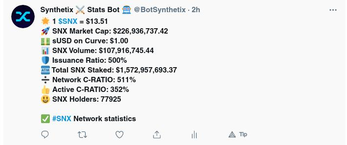
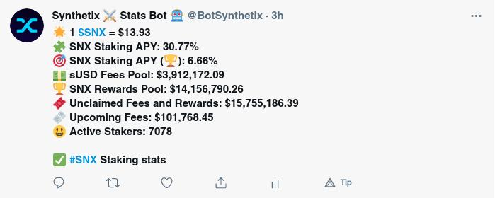
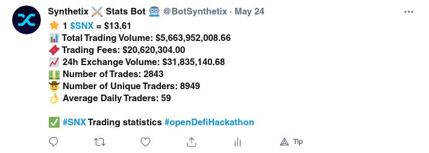
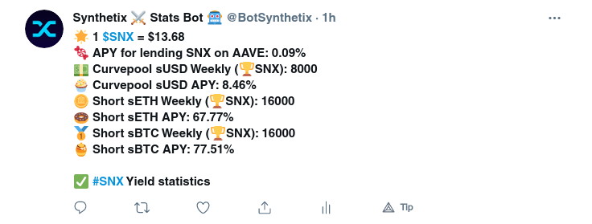
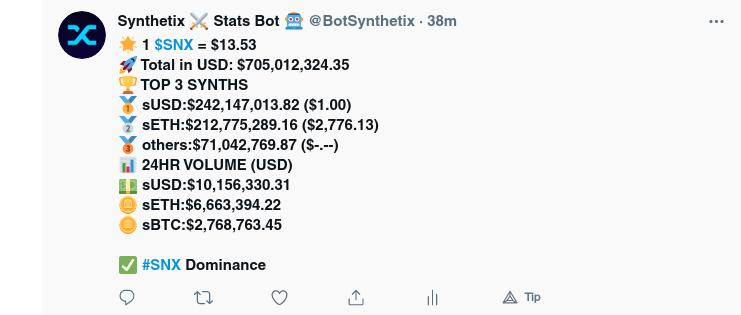
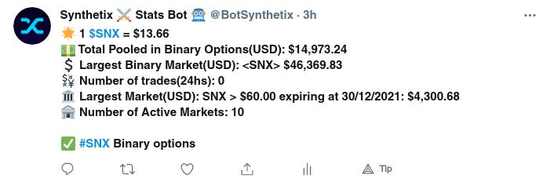

# Synthetix Stats Reporter Twitter Bot

`Build a Twitter Bot that tracks and reports on interesting Synthetix Stats.`

Each hour this bot will report a statatics about section bellow.
It will report trading fees and exchange volumes difference hourly too.
### Bot live: https://twitter.com/BotSynthetix

### General statistics

- Volume and rank
- Exchange Volume
- Trading Fees
- Total Value Locked
- Amount of SNX staked (% of total)`

### Network statistics

- Fully diluted market cap for SNX
- Price of sUSD on Curve
- SNX 24 hr volume from Coinmarketcap
- The base issuance ratio of SNX/(sUSD debt) for all SNX stakers
- The total value of all staked SNX
- The aggregate collateralization ratio of all SNX wallets
- The aggregate collateralization ratio of SNX wallets that are currently staking
- Total number of SNX holders

### Staking statistics

- SNX Staking APY
- SNX Staking APY (With rewards)
- Rewards pool
- Unclaimed fees and rewards
- Upcoming fees in next period
- Number of stakers

### Trading statistics

- Trading volume
- Trading fees
- 24h exchange volume
- Number of trades
- Number of unique traders
- Average daily traders

### Yield Farming statistics

- Lending APY
- Weekly rewards and APY for sUSD, sETH and sBTC

### Synths statistics

- Synths Dominance
- The total value of all Synths in USD
- Synths Top 10 +Volume 24hs
- Synths Top 10 +Marketcap 24hs

### Binary options statistics

- The total amount of capital pooled in active binary options markets
- The total number of trades over the past 24 hours in binary options markets
- Distribution of Synths within the Synthetix protocol
- The largest active binary options market (USD) expiring
- The current number of active binary options markets
